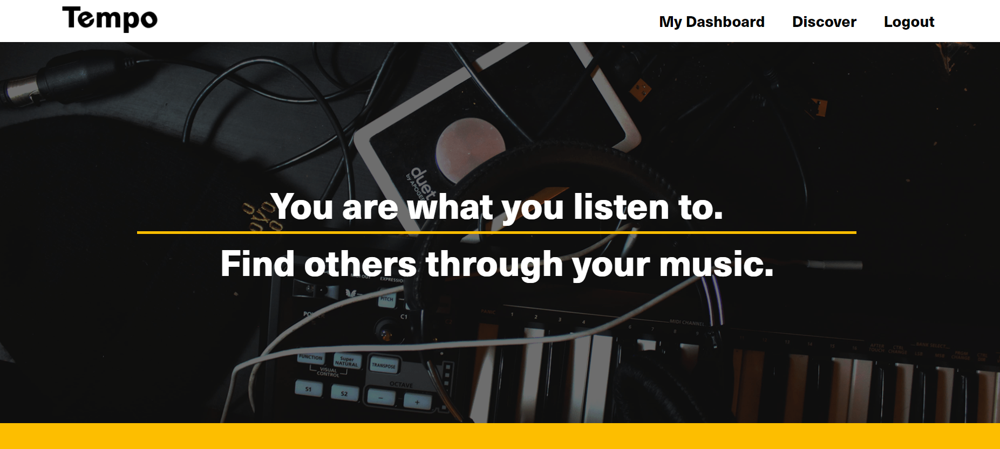

  # Tempo - Music Application
  

  

  ## Description
  Tempo is aimed at connecting bands and musicians together through media sharing. 
  
  Users can sign up or login into the site and select whether they are a 'Band' or a 'Musician'. They set their status, options include just browsing, open to collaborations, or looking for a new band member. Musicians will post links of their performances on the site, adding a title, description, and most importantly metadata such as instruments and genres. This allows other users to use the Discover page and search for criteria they are looking for (i.e. electric bass guitarists). Once a user is filtered then you can click into their profile, see all their linked performances, and review them. Reviews are for personal use only and will not be shared with the users being reviewed. This provides bands a way to track who they like and why. When you are interested in someone you can contact them via email from the site.

  ## Table of Contents
  1. [Installation](#installation)
  2. [Usage](#usage)
  3. [Contributing](#contributing)
  4. [Deployed](#deployed)
  5. [License](#license)
  6. [Gallery](#gallery)
  7. [Questions](#questions)

  ## Installation
  The application is available to use on Heroku at the link below. For installation purposes you can clone this repository, update associated npm packages, and begin working.

  ## Usage
  Connect Bands and Musicians!

  ## Contributing
  Submit pull requests and we will review for contribution.

  ## Deployed
  Check out the application on [Heroku](https://tempo-musician-search.herokuapp.com/)
  
  ## License
  Copyright (c) 2022 Adair, Andrew, Michael, and Max. Licensed under the MIT license.

  ## Gallery
Signup

  

  Musician Status

  

  Band Status

  

  Dashboard

  

  Discover Page

  

  Personal Review

  
  
  ## Questions
  Check out these pages for more cool projects:

  Adair - https://github.com/adairconlin

  Andrew - https://github.com/GitAndrewCoffee

  Max - https://github.com/mwin1201
  
  Michael - https://github.com/mwegter95

